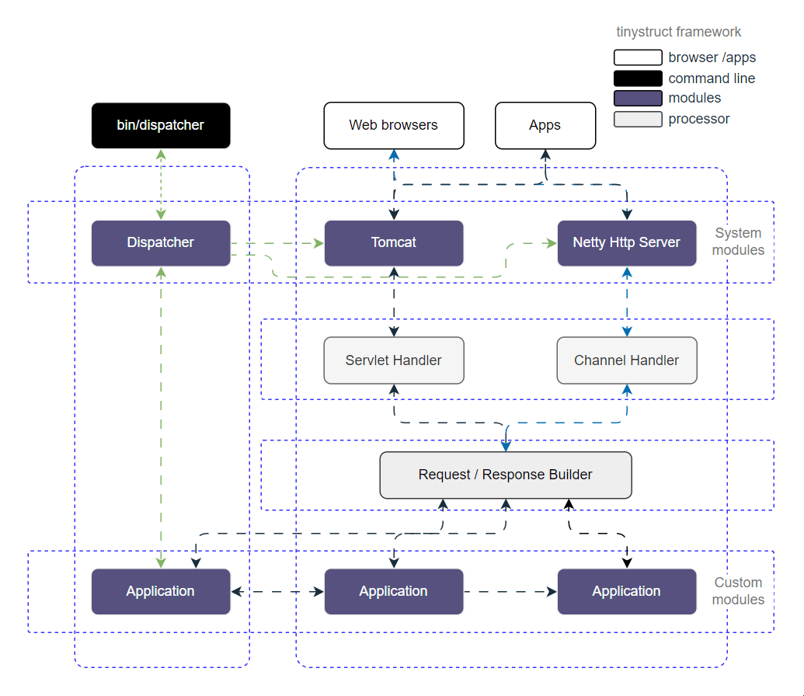

# tinystruct framework Documentation

[English](en/) | [中文](zh/)

Welcome to the tinystruct framework documentation. This documentation provides comprehensive guidance for using and developing with the tinystruct framework.

欢迎查阅 tinystruct 框架文档。本文档为使用和开发 tinystruct 框架提供全面的指导。

## What's New in v1.7.17

- **Enhanced AI Integration**: Built-in support for AI integration and plugin-based architecture
- **MCP Server Support**: Integration with Model Context Protocol (MCP) for advanced AI capabilities
- **Improved Performance**: Handling over 86,000 requests per second with ultra-low latency (~17ms)
- **HTTP Method-Specific Actions**: Support for HTTP method-specific routing (GET, POST, PUT, DELETE, etc.)
- **Modern Architecture**: No `main()` method required - start applications directly with CLI commands
- **Modular Design**: Plugin-based architecture for extensibility
- **Multiple Server Options**: Support for Netty, Tomcat, and Undertow
- **SSE Support**: Built-in Server-Sent Events support for real-time applications

## Choose Your Language / 选择语言

### [English Documentation](en/)
- [Getting Started](en/getting-started.md)
- [Core Concepts](en/core-concepts.md)
- [Web Applications](en/web-applications.md)
- [CLI Applications](en/cli-applications.md)
- [Configuration](en/configuration.md)
- [Database Integration](en/database.md)
- [Advanced Features](en/advanced-features.md)
- [Best Practices](en/best-practices.md)
- API Reference
  - [Application API](en/api/application.md)
  - [Action API](en/api/action.md)
  - [Configuration API](en/api/configuration.md)
  - [Database API](en/api/database.md)

### [中文文档](zh/)
- [入门指南](zh/getting-started.md)
- [核心概念](zh/core-concepts.md)
- [Web应用开发](zh/web-applications.md)
- [命令行应用](zh/cli-applications.md)
- [配置说明](zh/configuration.md)
- [数据库集成](zh/database.md)
- [高级特性](zh/advanced-features.md)
- [最佳实践](zh/best-practices.md)
- API参考
  - [应用程序 API](zh/api/application.md)
  - [动作 API](zh/api/action.md)
  - [配置 API](zh/api/configuration.md)
  - [数据库 API](zh/api/database.md)

## Quick Start

### Using the tinystruct Archetype

The fastest way to get started is using the tinystruct archetype:

```bash
# Follow the archetype to create a project quickly
https://github.com/tinystruct/tinystruct-archetype
```

### Manual Installation

Add the dependency to your `pom.xml`:

```xml
<dependency>
    <groupId>org.tinystruct</groupId>
    <artifactId>tinystruct</artifactId>
    <version>1.7.17</version>
    <classifier>jar-with-dependencies</classifier>
</dependency>
```

### Basic Example

```java
package tinystruct.examples;

import org.tinystruct.AbstractApplication;
import org.tinystruct.ApplicationException;
import org.tinystruct.system.annotation.Action;
import org.tinystruct.system.annotation.Action.Mode;

public class Example extends AbstractApplication {

    @Override
    public void init() {
        // Initialization code
    }

    @Override
    public String version() {
        return "1.0";
    }

    @Action("praise")
    public String praise() {
        return "Praise the Lord!";
    }

    @Action("say")
    public String say(String words) {
        return words;
    }

    // HTTP method-specific actions
    @Action(value = "hello", mode = Mode.HTTP_GET)
    public String helloGet() {
        return "GET";
    }

    @Action(value = "hello", mode = Mode.HTTP_POST)
    public String helloPost() {
        return "POST";
    }
}
```

## Why Choose tinystruct?

### Modern Design Philosophy

1. **No `main()` method required** - Applications start directly with CLI commands
2. **Unified CLI and Web** - Write once, run anywhere (CLI or Web)
3. **Built-in lightweight HTTP servers** - Netty, Tomcat, or Undertow
4. **Minimal configuration** - No excessive XML or YAML
5. **Performance-first architecture** - Zero overhead, no reflection-based scanning
6. **AI-ready** - Designed for AI integration with MCP support

### Performance Benchmarks

```
Running 30s test @ http://127.0.0.1:8080/?q=say/Praise the Lord!
12 threads and 400 connections

Requests/sec:  86753.98
Transfer/sec:  17.46MB
Latency:       17.44ms (avg)
```

## Architecture

tinystruct follows a modular, action-oriented architecture that enables:

- Code reuse between CLI and web applications
- Unified interface through `@Action` annotation
- Plugin-based extensibility
- Low-latency direct method invocation
- Flexible deployment options (monolithic, microservices, or hybrid)



## Contributing / 贡献

If you'd like to contribute to this documentation, please:
如果您想为此文档做出贡献,请：

1. Fork the repository / 复刻仓库
2. Create a new branch for your changes / 创建新的分支
3. Submit a pull request with your improvements / 提交拉取请求

## License / 许可证

This documentation is licensed under the same terms as the tinystruct framework (Apache License 2.0).
本文档采用与 tinystruct 框架相同的许可条款。
